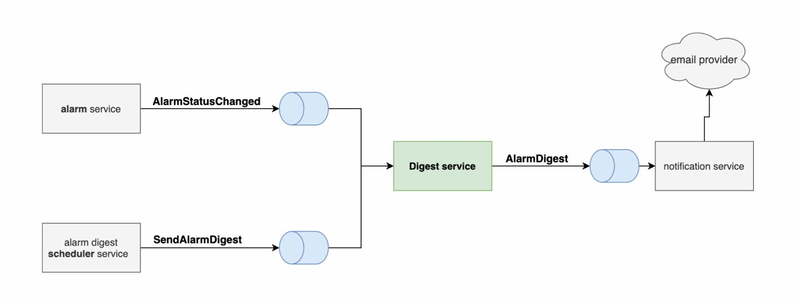

## Alarm Digest Service

## Acceptance Criteria:

Build a service that is part of a system that allow users to receive notifications for triggered alarms. This service 
should consume events from two topics and publish to another topic. The messaging system being used is [Nats](https://nats.io/). 



The messages that can be received are:

#### 1. AlarmStatusChanged
This event indicates that an agent has detected a status change on a specific Alarm and a certain user should be notified by this status change.

An alarm can be in one of the following statuses:

| Status   | Meaning     | Active? |
|----------|-------------| ------ |
| CLEARED  | Alarm is not triggered | NO |
| WARNING  | First threshold is reached   | YES |
| CRITICAL | Second threshold is reached |  YES |

An alarm is active when its status is either WARNING or CRITICAL.

#### 2.  SendAlarmDigest
This is an internal event triggered by one of the cloud’s microservices instructing your microservice to flush all gathered alarms in the form of an AlarmDigest to the appropriate users

When a SendAlarmDigest for a given user is received the service must send an AlarmDigest for that user.

The AlarmDigest message should include only active alarm which are in WARNING or CRITICAL state.

You will also need to create a publisher to send the AlarmDigest to the notification service
This message should contain the latest statuses for each alarm per user (please refer to the “Topics and message schemas” for details of the payloads


NOTES:
1. For the purposes of this challenge you can assume that your service will be part of an event driven system, with 
multiple microservices that communicate via messaging.
2. In the context of this challenge, nats will act as the message broker.
3. Our broker cannot guarantee in-order delivery of the messages
4. Our broker can guarantee at-least-one delivery for all topics
5. Your solution should be capable of handling any amount of messages
6. Your solution should be able to scale horizontally.
7. It is very important that all active alarms are eventually sent to the user, alarms should not be lost.
8. Ideally a user shouldn’t receive the same alarm twice, if its status has not changed since the last digest email.
9. Active alarms should be ordered chronologically (oldest to newest)


### Approach:

Please see prioritised ToDo's at the bottom of this README for things I'd have liked to with more time.

#### Nats
I used vanilla Nats rather than Nats streaming or Jetstream as it was not indicated/did not seem like the upstream 
producers and test server were using these. I would normally have sought clarification on this. 

Jetstream would have been my preferred mechanism and would have enabled a different approach. 

Likewise I did not implement Replies to guarantee delivery for my producer or subscriber as it was not indicated that 
the upstream producers would be using the reply-to field. I'm not sure if this was implied from the assertion that the 
broker could guarantee at-least-once delivery, so I would have asked for further clarification on this normally. 

I used a Nats subscriber queue group so that I did not need to implement de-duplication logic using the database.

#### State management
I used MongoDb for state, so that I could fetch historic alarms and keep track of the last digest request in order to 
only send new alarms downstream. 

I use an upsert operation to update or insert alarms. I use UnixNano timestamps in the DB, ensuring they are all UTC 
based on conversion.

I save a record of digest requests only after successfully producing the message so that subsequent digest requests will 
only send alarms after the last saved request. If the final save of the digest request fails, duplicate alarms will be 
sent with the subsequent request. 

#### **Testing**
The application can be run for end to end testing using a docker-compose script but this is not intended for production.

I used gomock for unit testing more complex interfaces and hand wrote mocks for simpler ones. 

I did not try to test the daos as the go mongodriver does not use interfaces which meant I would have had to build them 
out myself. Due to time constraints I skipped this in favour of integration tests that exercised the dao's happy paths. 

I didn't get to test the Nats Subscriber and Publisher also due to time constraints, but I would have liked to test 
specifically the drain implementation on cancellation. 

### To Run:

Run dockerised application with a db and nats server:
```shell script
docker-compose up
```

### Automated Testing:

Run unit tests:
```shell script
cd app
go test ./..
```

Run e2e tests:
```shell script
docker-compose -d up
cd e2e
go test
```

### Manual Testing:
Using nats-cli - https://github.com/nats-io/natscli

Subscribe to output:
```shell script
nats sub AlarmDigest
```

Send some test messages to the service in another terminal:
```shell script
nats pub AlarmStatusChanged "{ \"UserID\": \"1\", \"AlarmID\": \"{{ID}}\", \"Status\": \"CRITICAL\", \"ChangedAt\": \"{{TimeStamp}}\"  }"
nats pub AlarmStatusChanged "{ \"UserID\": \"2\", \"AlarmID\": \"{{ID}}\", \"Status\": \"CRITICAL\", \"ChangedAt\": \"{{TimeStamp}}\"  }"
nats pub AlarmStatusChanged "{ \"UserID\": \"2\", \"AlarmID\": \"{{ID}}\", \"Status\": \"CLEARED\", \"ChangedAt\": \"{{TimeStamp}}\"  }"
nats pub AlarmStatusChanged "{ \"UserID\": \"3\", \"AlarmID\": \"{{ID}}\", \"Status\": \"CRITICAL\", \"ChangedAt\": \"{{TimeStamp}}\"  }"
nats pub SendAlarmDigest "{ \"UserID\": \"2\" }"
```

### To Do:
1. Improve unit test coverage
2. Implement retries with a backoff for the Publisher 
3. Implement replies or use Jetstream for producer to guarantee delivery
4. Implement replies for subscribers or switch to Jetstream / Streaming and acks.
5. Implement MongoDb transactions in SendAlarmDigestHandler to ensure graceful shutdown and processing of inflight messages
6. Remove use of log.Fatal and ensure cleanup at top level
